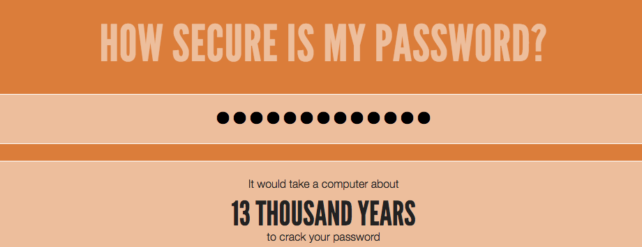

<h2 class="c-project-heading--task">Challenge: Create a better password</h2>

### Step 1
Use the Password Generator starter project to generate a password that would take more than 1,000 years to crack, but isn’t too long to type.

### Step 2
Go to <a href="https://www.security.org/how-secure-is-my-password/" target="_blank">www.security.org/how-secure-is-my-password/</a>.

### Step 3

Generate and test passwords until you find one that meets the goal.

Remember: a password is harder to guess if it is:
+ Long
+ Not a dictionary word
+ A mix of letters, numbers, and punctuation

These passwords help protect important accounts. Many adults use a password manager to remember lots of strong passwords.

