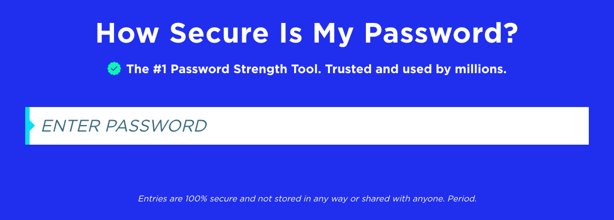

## Challenge: Create a better password

Use the 'Password generator' starter project to generate a password that would take more than 1000 years to crack, but is not too long to type.

## Step 1

Go to [www.security.org/how-secure-is-my-password](https://www.security.org/how-secure-is-my-password/).

## Step 2

Generate and test passwords until you find one that meets the goal.

> [!TIP]
> Remember: a password is harder to guess if it is:
>
> + Long
> + Not a dictionary word
> + A mix of letters, numbers, and punctuation
>
> Passwords help protect important accounts. Many adults use a password manager to remember lots of strong passwords.
